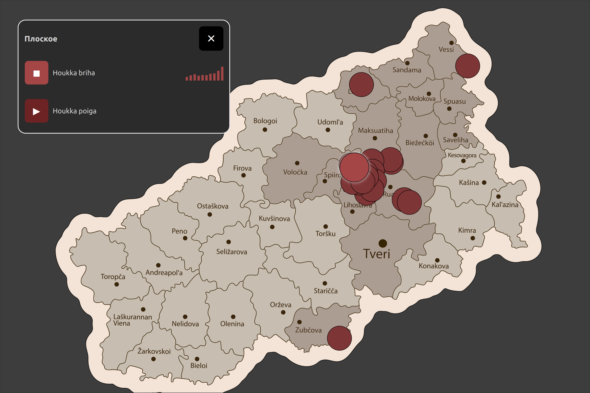

# TVERIN KARIELAN IÄNET  

**Голоса Тверской Карелии** это 
интерактивная карта, которая позволяет услышать речь носителей, собранную в разных населённых пунктах Тверской области.

Приложение работает в полноэкранном режиме, поддерживает тачскрин, масштабирование карты и воспроизведение аудио по нажатию на точку.

### Цель проекта
Представить звучание карельской речи (тверские карелы) в доступной, современной и интерактивной форме. 
Эта часть музейной экспозиции для погружения посетителя в звучание карельской речи. 
### Основное окно приложения (полноэкранный режим)


На экране представлены:
- аудиоплеер в режиме воспроизведения;
- маркеры населённых пунктов, для которых доступны записи образцов речи.
### Населённые пункты, представленные на карте

- **Андрюково**: `Matr’o-buabo`, `Paimenen ruado`
- **Большая Воздвиженка**: `Kyly, eri vigahizet`
- **Ветчино**: `Nuattirokka`
- **Высокое**: `Korgein časoun’a`
- **Гнездово**: `Voinan aigah`, `Častuškat, pruazniekkasripnät`
- **Еремеевка**: `Nasto-buabo`
- **Заболотье**: `Oma pereh`
- **Заручье**: `Suaharuo himottau`
- **Зубачиха**: `Oli ruaduo`
- **Ключевая**: `Pidi kylbie`
- **Колодово**: `Oli yksi akkane`
- **Мосеевское**: `Mi̬as’l’enčan’ed’el’illä...`
- **Мохнецы**: `Veššelä on`
- **Павлово**: `Kizat`
- **Плоское**: `Houkka briha`, `Houkka poiga`
- **Свищево**: `Mie naduumaičiin naija`
- **Семеновское**: `Voinan aigah`
- **Сосновка**: `Vuarničča`
- **Стан**: `Lähet meččäh`
- **Толмачи**: `Elettih cuari da carevna`, `Aštuu čibane`
- **Устюги**: `Ennein eliässeh elettih ukko da akka`
- **Черняево**: `Juduakka`

### Карта подготовлена на основе материалов

* [Открытого корпуса вепсского и карельского языков](https://dictorpus.krc.karelia.ru) — *КарНЦ РАН*
* todo: Антоновка records (c)

---


## Системные зависимости (Linux Mint 22.3 / Ubuntu 24.04)

Qt 6 требует нескольких библиотек X11 для корректной работы.

Установить:

```bash
sudo apt install \
    libxcb-cursor0 \
    libxcb-xinerama0 \
    libxcb-xinput0 \
    libxcb-render-util0 \
    libxcb-icccm4 \
    libxcb-image0 \
    libxcb-keysyms1 \
    libxcb-randr0 \
    libxcb-shape0 \
    libxcb-xfixes0 \
    libxkbcommon-x11-0 \
    libglu1-mesa
```
Вот компактный, технический и однозначный блок для README — без воды, только суть.

---

## 🚀 Запуск проекта

После установки системных зависимостей:


```
bash run.sh
```

```
./run.sh
```
